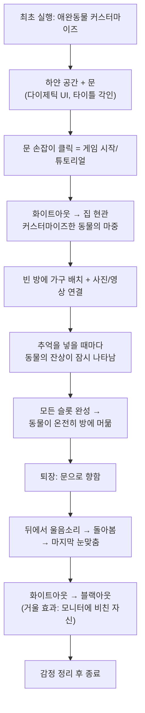

# Dear — 게임 기획 숙지 및 평가 보고서

## 📖 게임 개요 (내가 이해한 것)

**Dear**는 떠나보낸 애완동물을 위한 **3D 싱글플레이 디지털 메모리얼 게임**입니다.

### 핵심 컨셉
- 죽음·이별이 아니라 **"기억 속 새 보금자리로의 이사"** — 수미상관 구조
- 처음 데려왔을 때 보금자리를 만들어주던 경험 → 마지막으로 기억의 보금자리를 만들어주는 경험
- **'반려'가 아닌 '애완'** — 인간의 독단적 선택에 따른 절대적 책임감을 직시하는 철학

### 게임 플로우


### 핵심 시스템
| 시스템 | 설명 |
|--------|------|
| **커스터마이즈** | 레이어 시스템 (체형, 무늬, 색상, 액세서리) |
| **시간 연동** | PC 시간 기반 아침/저녁/밤 라이팅 + 시간대별 다른 사진 표시 |
| **로컬 미디어** | 외부 폴더에서 사진/영상 로드 → 가구에 연결 |
| **세이브** | 모든 데이터(미디어 포함) 단일 로컬 파일, 백업/Export 가능 |
| **마중 모션** | 시간대/접속 빈도에 따라 다른 동물 애니메이션 |
| **감성 셰이더** | 사실적이 아닌 감성적 표현 (수채화/셀 셰이딩 등) |

---

## ✅ Godot Lorebook 숙지 현황

`godot lorebook.md`에 명시된 아키텍처 규칙을 모두 읽었습니다:

| 규칙 | 핵심 |
|------|------|
| 컴포넌트 중심 | 기능별 독립 노드로 조립 |
| 결합도 최소화 | 하드코딩 Node Path 금지 |
| 데이터 주도 설계 | `@export` + `.tres` Resource, Magic Number 금지 |
| Call down, Signal up | 자식→부모: `signal`, 부모→자식: 함수 호출 |
| FSM 필수 | 플레이어/주요 객체에 상태 머신 적용 |
| 전역 통신 | `Global.gd` Singleton (남용 금지) |
| 명명 규칙 | 객관적·직관적 단어, `[역할]Component.gd` |
| 폴더 구조 | `res://scenes/components/`, `res://resources/data/` |
| 파일 I/O | `user://` 로컬 전용, 서버 통신 배제 |

> [!IMPORTANT]
> 앞으로 모든 코드 작성 시 이 lorebook의 규칙을 **엄격히** 준수하겠습니다.

---

## 🔍 평가: 바이브 코딩 수행을 위해 부족하거나 보완이 필요한 부분

### 1. 프로젝트 구조가 비어있음 — 🟡 즉시 해결 가능
현재 `PJ_Dear` 프로젝트는 [project.godot](file:///c:/GODOT%20PJ/pj-dear/project.godot)와 [icon.svg](file:///c:/GODOT%20PJ/pj-dear/icon.svg)만 있는 완전 빈 상태입니다. lorebook에 명시된 폴더 구조를 먼저 세워야 합니다.

**필요 작업:**
```
res://
├── scenes/
│   ├── components/      # 범용 컴포넌트 스크립트
│   ├── characters/      # 동물 모델/씬
│   ├── environment/     # 방, 문, 가구 등
│   └── ui/              # 커스터마이즈, 미디어 뷰어 등
├── resources/
│   └── data/            # .tres 리소스 파일
├── scripts/
│   └── global/          # Global.gd 등 싱글톤
├── shaders/             # 감성 셰이더 파일
├── assets/
│   ├── models/          # 3D 모델
│   ├── textures/        # 텍스처
│   ├── audio/           # 사운드/음악
│   └── animations/      # 애니메이션
└── addons/              # 플러그인 (필요시)
```

### 2. 구체적인 기능 명세서(Feature Spec) 부재 — 🟡 중요
`dear 기획안.md`는 Gemini와의 대화 통으로 되어 있어, **정제된 기능 목록과 우선순위**가 없습니다. 바이브 코딩으로 효율적으로 진행하려면 각 기능을 구현 단위로 쪼갠 **체크리스트**가 필요합니다.

### 3. 3D 에셋 (모델링) — 🔴 AI로 해결 불가
아래 3D 에셋은 **직접 제작하거나 외부에서 조달**해야 합니다:
- 동물 기본 모델 (공통 Skeleton3D 리그 포함)
- 커스터마이즈용 파츠 (귀/꼬리/무늬 변형)
- 방(Room) 모델 + 하얀 복도/문
- 가구 모델들 (캣타워, 밥그릇, 방석, 장난감 등)

> [!CAUTION]
> 3D 모델링·리깅·애니메이션은 AI 코딩 어시스턴트의 영역 밖입니다. Blender 등으로 직접 제작하시거나, 로우폴리 에셋을 활용하신 뒤 셰이더로 분위기를 입히는 전략을 추천합니다.

### 4. 사운드/음악 에셋 — 🔴 AI로 해결 불가
- 동물 울음소리 (마중, 배웅)
- 환경 사운드 (문 열림, 발걸음)
- 배경 음악 (시간대별 분위기)

### 5. 커스텀 셰이더 설계 — 🟡 부분적으로 도움 가능
- 감성적 셰이더의 **구체적인 비주얼 레퍼런스**가 있으면 구현 방향을 잡기 훨씬 수월합니다
- Godot Shader Language로 셀 셰이딩, 아웃라인, 포스트 프로세싱 등의 코드는 제가 작성할 수 있습니다

### 6. 세이브 파일에 미디어 포함 구조 — 🟡 설계 필요
- 사진/영상을 세이브 파일에 **직접 포함**할지, **경로 참조**로 할지 구체적 결정 필요
- 직접 포함 시 파일 크기 문제 (영상 1개 = 수십~수백 MB)
- 추천: 전용 폴더 구조 + 메타데이터 JSON 방식, 백업 시 폴더째 압축

---

## ✅ AI(바이브 코딩)로 제가 도울 수 있는 것

| 영역 | 가능 여부 | 구체적으로 |
|------|-----------|-----------|
| GDScript 전반 | ✅ 가능 | FSM, 컴포넌트, 시그널, 시간 연동 등 모든 로직 |
| 셰이더 코드 | ✅ 가능 | 셀 셰이딩, 아웃라인, 포스트 프로세싱, 화이트아웃/블랙아웃 |
| UI 시스템 | ✅ 가능 | 커스터마이즈 UI, 미디어 뷰어, 다이제틱 UI |
| 로컬 파일 I/O | ✅ 가능 | `FileAccess`, `DirAccess`로 외부 이미지/영상 로드 |
| 세이브/로드 | ✅ 가능 | JSON/Resource 기반 세이브 시스템 |
| 시간 연동 라이팅 | ✅ 가능 | `Time.get_time_dict_from_system()` 활용 |
| 씬 전환/연출 | ✅ 가능 | Tween, AnimationPlayer 기반 페이드/전환 |
| 3D 모델링 | ❌ 불가 | Blender 등 외부 도구 필요 |
| 리깅/애니메이션 제작 | ❌ 불가 | 직접 제작 필요 |
| 사운드/음악 제작 | ❌ 불가 | 직접 제작 또는 에셋 조달 필요 |

---

## 💡 제안: 첫 번째로 함께 할 작업

에셋이 없는 현 단계에서 바로 시작할 수 있는 작업을 추천합니다:

1. **프로젝트 폴더 구조** 세팅 (lorebook 기준)
2. **Global.gd 싱글톤** 기초 구조 작성
3. **FSM 기반 게임 상태 관리** (커스터마이즈 → 하얀방 → 집)
4. **프로토타입용 기본 씬** (CSGBox3D 등 프리미티브로 하얀 방 + 문 구현)
5. **1인칭 카메라 + 클릭 상호작용** 시스템

> 3D 모델이 없어도 **프리미티브(CSG)와 기본 도형**으로 전체 흐름을 먼저 구현해두면, 나중에 에셋을 교체하기만 하면 됩니다.

어떤 작업부터 시작할지 말씀해 주세요!
